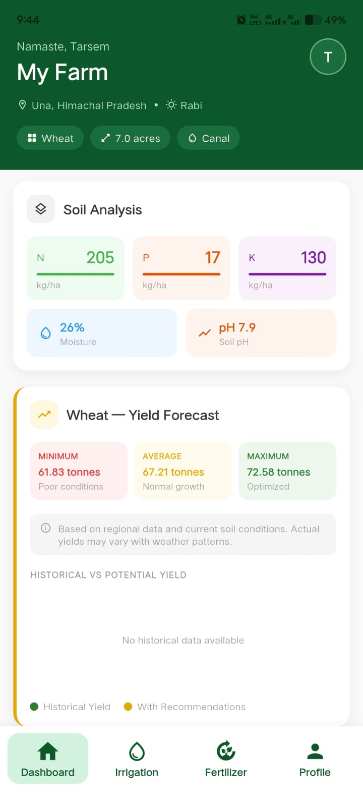

# KhetBuddy: From Problem Discovery to Product Launch

## Product Management Case Study

**Author:** Tarsem Gulab

**Role:** Product Lead

**Duration:** January 2026 – April 2026

**Domain:** Agriculture Technology

---

## Executive Summary

KhetBuddy is a farm management platform designed to help small-hold farmers make better agricultural decisions through crop planning, irrigation scheduling, fertilizer recommendations, yield prediction, and advisory delivery.

The project began with a simple observation:

> Farmers often make critical decisions using fragmented information sources, delayed recommendations, and manual planning.

The objective was to create a platform that could centralize farm operations while remaining simple enough for real-world adoption.

This case study documents the product thinking, research, prioritization decisions, MVP definition, implementation strategy, and lessons learned throughout the development process.

---

# Problem Statement

Small-hold farmers face several recurring challenges:

* Unpredictable weather conditions
* Irrigation planning uncertainty
* Lack of localized recommendations
* Delayed access to agricultural advisories
* Fragmented information sources

Many existing solutions require dedicated mobile applications and technical familiarity, creating additional adoption barriers.

The challenge was:

> How might we help farmers make better agricultural decisions through accessible and personalized recommendations?

---

# Product Vision

Enable small-hold farmers to make data-driven agricultural decisions through accessible, personalized, and timely recommendations.

---

# Product Goals

## User Goals

* Improve crop planning
* Reduce irrigation uncertainty
* Receive timely recommendations
* Improve productivity

## Product Goals

* Increase farmer adoption
* Improve recommendation engagement
* Deliver actionable insights
* Create a scalable decision-support platform

---

# Product Lifecycle

## Phase 1: Problem Discovery

Objective:

Understand challenges faced by small-hold farmers.

Activities:

* Studied agricultural workflows
* Analyzed farming pain points
* Evaluated existing solutions
* Identified adoption barriers

Outcome:

* Defined core user problems
* Established target users
* Created product vision

---

## Phase 2: Product Definition

Objective:

Define the minimum viable product.

Activities:

* Prioritized user problems
* Defined MVP scope
* Designed user workflows
* Established success metrics

Outcome:

* Finalized feature roadmap
* Identified launch priorities

---

## Phase 3: Product Build & Launch

Objective:

Build and deploy the MVP.

Activities:

* Developed backend services
* Integrated weather intelligence
* Implemented WhatsApp notifications
* Deployed platform infrastructure

Outcome:

* Functional farm management platform
* End-to-end recommendation workflow

---

# Solution Overview

KhetBuddy includes:

* Farm Registration
* Crop Planning
* Farm Management
* Fertilizer Recommendations
* Irrigation Scheduling
* Yield Prediction
* WhatsApp Advisories

---

# Product Assets

## User Workflow

## System Architecture

## Product Dashboard

## Whatsapp Client

---

# Deep Dive Documents

* [User Research](docs/user-research.md)
* [Feature Prioritization](docs/prioritization.md)
* [Product Metrics](docs/product-metrics.md)

---

# Product Build

### Technology Stack

Backend

* Java
* Spring Boot

Database

* PostgreSQL

Integrations

* WhatsApp Cloud API
* Weather APIs

Infrastructure

* Render
* Supabase

---

# Reflection

The most important lesson from KhetBuddy was that adoption is often a bigger challenge than implementation.

Initially, I focused heavily on technical capabilities. However, during product definition I realized that delivering recommendations through WhatsApp could create more value than building additional platform features.

That decision influenced the direction of the product more than any technical implementation.

---

# Future Roadmap

## Phase 2

* Marketplace Integration
* Community Features
* Advanced Analytics

## Phase 3

* AI-Powered Recommendations
* Financial Services
* Regional Language Support

---

# Repository

Implementation Repository:

https://github.com/gittarsem/khetbuddy-backend
